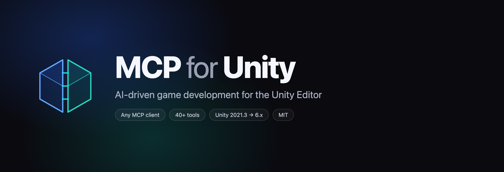
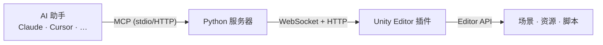

| [English](../../README.md) | [简体中文](README-zh.md) |
|----------------------|---------------------------------|

#### 由 [Aura](https://www.tryaura.dev/) 荣誉赞助并维护 —— 面向 Unreal 与 Unity 的 AI 助手。
##### 别错过 [Godot AI](https://github.com/hi-godot/godot-ai) 🤖，MCP for Unity 团队推出的全新开源 MCP/AI 项目！

[](https://coplaydev.github.io/unity-mcp/)
[](https://discord.gg/y4p8KfzrN4)
[](https://www.coplay.dev/?ref=unity-mcp)
[](https://unity.com/releases/editor/archive)
[](https://www.python.org)
[](https://modelcontextprotocol.io/introduction)
[](https://opensource.org/licenses/MIT)
[](https://pypi.org/project/mcpforunityserver/)
[](https://pepy.tech/project/mcpforunityserver)
[](https://github.com/CoplayDev/unity-mcp/releases)
[](https://github.com/CoplayDev/unity-mcp/actions/workflows/python-tests.yml)
[](https://openupm.com/packages/com.coplaydev.unity-mcp/)
[](https://github.com/CoplayDev/unity-mcp/stargazers)

**用大语言模型创建你的 Unity 应用！** MCP for Unity 通过 [Model Context Protocol](https://modelcontextprotocol.io/introduction) 将 AI 助手（Claude、Cursor、VS Code 等）与你的 Unity Editor 连接起来。为你的大语言模型提供管理资源、控制场景、编辑脚本和自动化任务的工具。


---

## 它能做什么

用自然语言从任意 MCP 客户端控制 Unity Editor。告诉助手你想做的事
—— "添加一个带 Rigidbody 的玩家"、"写一个存档系统"、"运行测试"
—— 助手将通过 40+ 个专注的工具驱动 Editor。

- **场景与 GameObject** — 创建、查询、修改层级、组件、预制体
- **脚本** — 创建/编辑 C#，带 Roslyn 验证
- **资源与渲染** — 材质、着色器、贴图、VFX
- **构建、测试与性能** — 运行 EditMode/PlayMode 测试、Profiler、构建
- **任意 MCP 客户端** — Claude、Cursor、VS Code、Windsurf、Gemini CLI 等
- **免费 & MIT**，支持多实例

<details>
<summary><b>完整工具目录（40+ 工具，9 组）</b></summary>

查看 [工具参考](https://coplaydev.github.io/unity-mcp/reference/tools/) 了解所有工具：**core**（场景、GameObject、脚本、资源、预制体、组件、编辑器控制、控制台、菜单）、**scripting_ext**、**vfx**（着色器、贴图）、**ui**、**animation**、**testing**、**probuilder**、**profiling**、**docs**。

### 可用工具
`apply_text_edits` • `batch_execute` • `create_script` • `debug_request_context` • `delete_script` • `execute_custom_tool` • `execute_menu_item` • `find_gameobjects` • `find_in_file` • `get_sha` • `get_test_job` • `manage_animation` • `manage_asset` • `manage_build` • `manage_camera` • `manage_components` • `manage_editor` • `manage_gameobject` • `manage_graphics` • `manage_material` • `manage_packages` • `manage_physics` • `manage_prefabs` • `manage_probuilder` • `manage_profiler` • `manage_scene` • `manage_script` • `manage_script_capabilities` • `manage_scriptable_object` • `manage_shader` • `manage_texture` • `manage_tools` • `manage_ui` • `manage_vfx` • `read_console` • `refresh_unity` • `run_tests` • `script_apply_edits` • `set_active_instance` • `unity_docs` • `unity_reflect` • `validate_script`

### 可用资源
`cameras` • `custom_tools` • `renderer_features` • `rendering_stats` • `volumes` • `editor_active_tool` • `editor_prefab_stage` • `editor_selection` • `editor_state` • `editor_windows` • `gameobject` • `gameobject_api` • `gameobject_component` • `gameobject_components` • `get_tests` • `get_tests_for_mode` • `menu_items` • `prefab_api` • `prefab_hierarchy` • `prefab_info` • `project_info` • `project_layers` • `project_tags` • `tool_groups` • `unity_instances`

**性能提示：** 多个操作请使用 `batch_execute` — 比逐个调用快 10-100 倍！
</details>

---

## 支持的客户端和版本

| MCP 客户端 | 自动配置 | 备注 |
|---|---|---|
| Claude Desktop / Claude Code | ✅ | stdio |
| Cursor | ✅ | stdio |
| VS Code (Copilot) | ✅ | stdio |
| Windsurf | ✅ | stdio |
| Cline | ✅ | stdio |
| Gemini CLI / Qwen Code | ✅ | stdio |
| Copilot CLI / OpenClaw / Antigravity | ✅ | stdio |

**环境要求：** Unity **2021.3 LTS → Unity 6.x**，Python **3.10+**（通过 `uv` 管理）。
使用 **Window → MCP for Unity → Configure All Detected Clients** 一键配置所有已检测到的客户端。

---

## 60秒快速开始

**前置要求：** Unity 2021.3 LTS+、一个 MCP 客户端，以及 [uv](https://docs.astral.sh/uv/)（如未安装将自动安装）。

1. **安装包**（Unity → Package Manager → 从 git URL 添加）：
   `https://github.com/CoplayDev/unity-mcp.git?path=/MCPForUnity#beta`
2. **配置客户端：** `Window → MCP for Unity → Configure All Detected Clients`。
3. **发出提示：** *"在原点创建一个立方体并添加 Rigidbody。"*
   几秒内你将看到场景中出现该立方体。

<details>
<summary>其他安装方式（Asset Store、OpenUPM）</summary>

**Unity Asset Store：**
1. 访问 [Asset Store 上的 MCP for Unity](https://assetstore.unity.com/packages/tools/generative-ai/mcp-for-unity-ai-driven-development-329908)
2. 点击 `Add to My Assets`，然后通过 `Window > Package Manager` 导入

**OpenUPM：**
```bash
openupm add com.coplaydev.unity-mcp
```
</details>

<details>
<summary><strong>手动配置</strong></summary>

如果自动设置不生效，请把下面内容添加到你的 MCP Client 配置文件中：

**HTTP（默认 — 适用于 Claude Desktop、Cursor、Windsurf）：**
```json
{
  "mcpServers": {
    "unityMCP": {
      "url": "http://localhost:8080/mcp"
    }
  }
}
```

**VS Code：**
```json
{
  "servers": {
    "unityMCP": {
      "type": "http",
      "url": "http://localhost:8080/mcp"
    }
  }
}
```

<details>
<summary>Stdio 配置（uvx）</summary>

**macOS/Linux：**
```json
{
  "mcpServers": {
    "unityMCP": {
      "command": "uvx",
      "args": ["--from", "mcpforunityserver", "mcp-for-unity", "--transport", "stdio"]
    }
  }
}
```

**Windows：**
```json
{
  "mcpServers": {
    "unityMCP": {
      "command": "C:/Users/YOUR_USERNAME/AppData/Local/Microsoft/WinGet/Links/uvx.exe",
      "args": ["--from", "mcpforunityserver", "mcp-for-unity", "--transport", "stdio"]
    }
  }
}
```
</details>
</details>

---

## 工作原理



---

## 如何比较

- **MCP for Unity** — 免费、MIT、支持任意客户端的 MCP 原生 Editor 控制。
- **[Aura for Unity](https://www.tryaura.dev/)** — 高级 Editor 内 AI 助手（赞助商）。
- **自定义 Editor 脚本** — 完全控制，但需要自己构建和维护。

---

<details>
<summary><strong>最近更新</strong></summary>

* **v9.6.3 (beta)** — 新增 `manage_profiler` 工具（14个操作）：Profiler 会话控制（启动/停止/状态/设置区域）、帧时间与计数器读取、对象内存查询、内存快照（通过 com.unity.memoryprofiler 进行拍摄/列表/比较）、帧调试器（启用/禁用/获取事件）。分组：`profiling`。
* **v9.6.2** — 新增 `manage_physics` 工具（21个操作）：物理设置、层碰撞矩阵、物理材质、关节（5种3D + 9种2D类型）、查询（raycast、raycast_all、linecast、shapecast、overlap）、力施加（AddForce/AddTorque/AddExplosionForce）、刚体配置、场景物理验证与编辑器模式模拟。全面支持3D和2D物理。
* **v9.6.1** — QoL 扩展：`manage_editor` 新增撤销/重做操作。`manage_scene` 新增多场景编辑（叠加加载、关闭、设置活动场景、跨场景移动物体）、场景模板（3d_basic、2d_basic 等）、场景验证与自动修复。新增 `manage_build` 工具：触发玩家构建、切换平台、配置玩家设置、管理构建场景和配置文件（Unity 6+）、跨多平台批量构建、异步任务跟踪与轮询。新增 `MaxPollSeconds` 基础设施，支持长时间运行的工具操作。
* **v9.5.4** — 新增 `unity_reflect` 和 `unity_docs` 工具用于 API 验证：通过反射检查实时 C# API，获取官方 Unity 文档（ScriptReference、Manual、包文档）。新增 `manage_packages` 工具：安装、移除、搜索和管理 Unity 包及作用域注册表。包含输入验证、移除时依赖检查和 git URL 警告。
* **v9.5.3** — 新增 `manage_graphics` 工具（33个操作）：体积/后处理、光照烘焙、渲染统计、管线设置、URP渲染器特性。3个新资源：`volumes`、`rendering_stats`、`renderer_features`。
* **v9.5.2** — 新增 `manage_camera` 工具，支持 Cinemachine（预设、优先级、噪声、混合、扩展）、`cameras` 资源、通过 SerializedProperty 修复优先级持久化问题。

<details>
<summary>更早的版本</summary>

* **v9.4.8** — 新编辑器 UI、通过 `manage_tools` 实时切换工具、技能同步窗口、多视图截图、一键 Roslyn 安装器、支持 Qwen Code 与 Gemini CLI 客户端、通过 `manage_probuilder` 进行 ProBuilder 网格编辑。
* **v9.4.7** — 支持按调用路由 Unity 实例、修复 macOS pyenv PATH 问题、脚本工具的域重载稳定性提升。
* **v9.4.6** — 新增 `manage_animation` 工具、支持 Cline 客户端、失效连接检测、工具状态跨重载持久化。
* **v9.4.4** — 可配置 `batch_execute` 限制、按会话状态过滤工具、修复 IPv6/IPv4 回环问题。

</details>
</details>

---

<details>
<summary><strong>多个 Unity 实例</strong></summary>

MCP for Unity 支持多个 Unity Editor 实例。要将操作定向到某个特定实例：

1. 让你的大语言模型检查 `unity_instances` 资源
2. 使用 `set_active_instance` 并传入 `Name@hash`（例如 `MyProject@abc123`）
3. 后续所有工具都会路由到该实例
</details>

<details>
<summary><strong>Roslyn 脚本验证（高级）</strong></summary>

要使用能捕获未定义命名空间、类型和方法的 **Strict** 验证：

1. 安装 [NuGetForUnity](https://github.com/GlitchEnzo/NuGetForUnity)
2. `Window > NuGet Package Manager` → 安装 `Microsoft.CodeAnalysis` v5.0
3. 同时安装 `SQLitePCLRaw.core` 和 `SQLitePCLRaw.bundle_e_sqlite3` v3.0.2
4. 在 `Player Settings > Scripting Define Symbols` 中添加 `USE_ROSLYN`
5. 重启 Unity

  <details>
  <summary>手动 DLL 安装（如果 NuGetForUnity 不可用）</summary>

  1. 从 [NuGet](https://www.nuget.org/packages/Microsoft.CodeAnalysis.CSharp/) 下载 `Microsoft.CodeAnalysis.CSharp.dll` 及其依赖项
  2. 将 DLL 放到 `Assets/Plugins/` 目录
  3. 确保 .NET 兼容性设置正确
  4. 在 Scripting Define Symbols 中添加 `USE_ROSLYN`
  5. 重启 Unity
  </details>
</details>

<details>
<summary><strong>故障排除</strong></summary>

* **Unity Bridge 无法连接：** 检查 `Window > MCP for Unity` 状态，重启 Unity
* **Server 无法启动：** 确认 `uv --version` 可用，并检查终端错误
* **Client 无法连接：** 确认 HTTP server 正在运行，并且 URL 与你的配置一致

**详细的设置指南：**
* [Fix Unity MCP and Cursor, VSCode & Windsurf](https://github.com/CoplayDev/unity-mcp/wiki/1.-Fix-Unity-MCP-and-Cursor,-VSCode-&-Windsurf) — uv/Python 安装、PATH 问题
* [Fix Unity MCP and Claude Code](https://github.com/CoplayDev/unity-mcp/wiki/2.-Fix-Unity-MCP-and-Claude-Code) — Claude CLI 安装
* [Common Setup Problems](https://github.com/CoplayDev/unity-mcp/wiki/3.-Common-Setup-Problems) — macOS dyld 错误、FAQ

还是卡住？[开一个 Issue](https://github.com/CoplayDev/unity-mcp/issues) 或 [加入 Discord](https://discord.gg/y4p8KfzrN4)
</details>

<details>
<summary><strong>贡献</strong></summary>

开发环境设置见 [README-DEV.md](../development/README-DEV.md)。自定义工具见 [CUSTOM_TOOLS.md](../reference/CUSTOM_TOOLS.md)。

1. Fork → 创建 issue → 新建分支（`feature/your-idea`）→ 修改 → 提 PR
</details>

<details>
<summary><strong>遥测与隐私</strong></summary>

匿名、注重隐私的遥测（不包含代码、项目名或个人数据）。可通过 `DISABLE_TELEMETRY=true` 关闭。详见 [TELEMETRY.md](../reference/TELEMETRY.md)。
</details>

---

**许可证：** MIT — 查看 [LICENSE](../../LICENSE) | **需要帮助？** [Discord](https://discord.gg/y4p8KfzrN4) | [Issues](https://github.com/CoplayDev/unity-mcp/issues)

---

## Star 历史

[](https://www.star-history.com/#CoplayDev/unity-mcp&Date)

<details>
<summary><strong>研究引用</strong></summary>
如果你正在进行与 Unity-MCP 相关的研究，请引用我们！

```bibtex
@inproceedings{10.1145/3757376.3771417,
author = {Wu, Shutong and Barnett, Justin P.},
title = {MCP-Unity: Protocol-Driven Framework for Interactive 3D Authoring},
year = {2025},
isbn = {9798400721366},
publisher = {Association for Computing Machinery},
address = {New York, NY, USA},
url = {https://doi.org/10.1145/3757376.3771417},
doi = {10.1145/3757376.3771417},
series = {SA Technical Communications '25}
}
```
</details>

## Aura 的 Unity AI 工具

Aura 提供 2 个 Unity AI 工具：
- **MCP for Unity** 在 MIT 许可证下免费提供。
- **Aura for Unity** 是一款面向游戏开发者打造的高级 Unity/Unreal AI 助手。

## 免责声明

本项目是一个免费开源的 Unity Editor 工具，与 Unity Technologies 无关。
