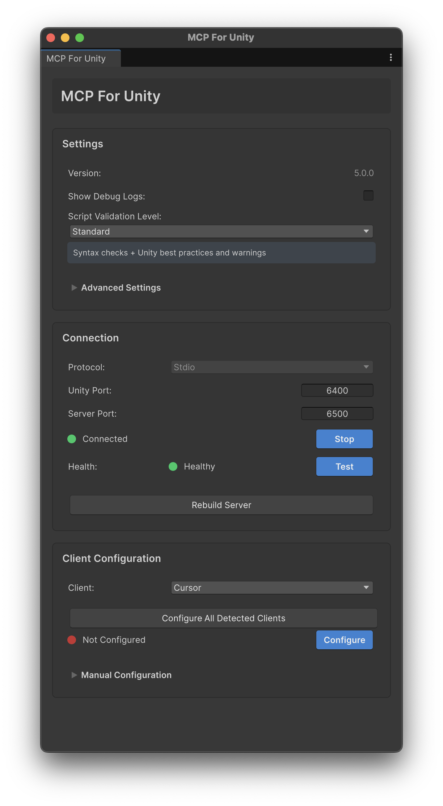
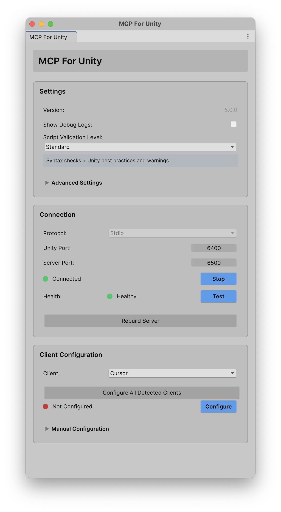

# New MCP Editor Window Summary




## **Major Changes**

**Architecture:**
- ✅ Introduced service layer with `IBridgeControlService`, `IClientConfigurationService`, `IPathResolverService`
- ✅ Created `MCPServiceLocator` for dependency-free service access
- ✅ Separated business logic from UI - window is now pure UI orchestration
- ✅ All configuration logic moved to services for reusability and testability

**New Features:**
- ✅ **Advanced Settings section** with path overrides (Python server, UV) with visual validation
- ✅ **Bridge health verification** with separate status indicator and manual test button
- ✅ **"Configure All Detected Clients"** button with summary dialog (shows success/failure/skipped counts)
- ✅ **Dynamic Claude Code Register/Unregister** button with CLI path override support
- ✅ **Auto-rewrite on path mismatch** - silently fixes outdated config paths
- ✅ **OnFocus refresh logic** - updates status after domain reloads and external config edits
- ✅ **Path override persistence** - overrides saved to EditorPrefs and survive restarts
- ✅ **Opt-in auto-start** - Bridge only auto-starts after user opens a window for the first time
- ✅ **Auto-Start Bridge toggle** - User can enable/disable auto-start behavior in settings

**Bug Fixes:**
- ✅ Fixed Claude Code detection (now only checks for "unityMCP", removed candidate name hacks)
- ✅ Fixed Unity 2021 compatibility (added `UnityEditor.UIElements` using statement)
- ✅ Debug toggle now functional (used in service logging)

---

## **Features Left Behind (By Design)**

### **Removed: Auto-Setup Behavior**
**Old Window:**
- `AutoFirstRunSetup()` - Automatically configured clients on first run
- `autoRegisterEnabled` flag - Controlled automatic registration
- Project-scoped SHA1 key to track first-run
- `lastClientRegisteredOk` / `lastBridgeVerifiedOk` state flags
- Button text changed to "Connected ✓" after successful setup

**Rationale:** Users now have explicit control. Setup is manual via "Configure All Clients" button.

---

### **Removed: Python Detection Warning**
**Old Window:**
- Checked for Python installation on system
- Showed warning banner with link to python.org if not found

**Status:** Setup Wizard handles this

---

### **Removed: Separate Manual Setup Windows**
**Old Window:**
- `VSCodeManualSetupWindow` - Dedicated popup for VSCode config
- `ManualConfigEditorWindow` - Dedicated popup for other clients

**New Window:**
- Inline "Manual Configuration" foldout with copy/paste functionality
- Simpler UX, less window clutter

**Status:** Old popup windows still exist in codebase but aren't used by new window.

---

### **Removed: Server Installation Status Section**
**Old Window:**
- "Server Status" panel showing "Installed" / "Not Installed"
- Server installation color indicator
- "Auto-Setup" button
- "Select server folder..." troubleshooting button

**New Window:**
- Server path is in "Advanced Settings" as override
- No separate installation status display
- "Rebuild Server" button in Connection section

---

### **Removed: Auto-Connect Toggle**
**Old Window:**
- Toggle to enable/disable auto-registration

**Status:** Not needed since auto-setup was removed.

---

### **Simplified: Error Handling**
**Old Window:**
- Complex error states and fallback logic
- Multiple status colors and states
- Detailed troubleshooting UI per client

**New Window:**
- Errors shown in Unity Console with red status labels
- Cleaner UI focused on happy path
- Advanced troubleshooting via path overrides

---

## **Key Differences Summary**

| Feature | Old Window | New Window | Status |
|---------|-----------|------------|--------|
| **Auto First-Run Setup** | ✅ Automatic | ❌ Manual only | Removed by design |
| **Bridge Verification** | ⚠️ Hidden (only in setup) | ✅ Visible with health indicator | Enhanced |
| **Path Overrides** | ⚠️ Python only, buried | ✅ Python + UV, in Advanced Settings | Enhanced |
| **Configure All Clients** | ❌ None | ✅ With summary dialog | New |
| **Claude Code** | ✅ Register/Unregister | ✅ Register/Unregister + path picker | Enhanced |
| **Manual Config** | ✅ Separate windows | ✅ Inline foldout | Simplified |
| **Auto-Rewrite** | ✅ In CheckMcpConfiguration | ✅ In ClientConfigurationService | Refactored |
| **OnFocus Refresh** | ✅ Bridge + client status | ✅ Bridge + client + paths | Enhanced |
| **Python Detection** | ✅ Warning banner | ❌ None | Removed |
| **Server Status Panel** | ✅ Separate section | ❌ Integrated | Simplified |
| **Debug Logs** | ✅ Toggle + logging | ✅ Toggle + service logging | Maintained |
| **Validation Levels** | ✅ 4 levels | ✅ 4 levels | Maintained |

---

## **Service Architecture**

### **IBridgeControlService**
Manages MCP for Unity Bridge lifecycle and health verification.

**Responsibilities:**
- Start/Stop bridge with intelligent auto-connect
- Bridge health verification (Option C: verify on connect + manual test)
- Framed protocol handshake validation
- Detailed verification results (handshake, ping/pong)

**Implementation:** `BridgeControlService`

---

### **IClientConfigurationService**
Handles MCP client configuration and registration.

**Responsibilities:**
- Configure individual clients
- Configure all detected clients with summary
- Auto-rewrite on path mismatch during status checks
- Register/Unregister Claude Code (fixed to only check "unityMCP")
- Generate config JSON and installation steps

**Implementation:** `ClientConfigurationService`

---

### **IPathResolverService**
Resolves paths to required tools with override support.

**Responsibilities:**
- Python server path with override support
- UV path with override support
- Claude CLI path with override support
- Override persistence via EditorPrefs
- Path validation and detection

**Implementation:** `PathResolverService`

---

### **MCPServiceLocator**
Static service locator for accessing MCP services without dependency injection.

**Features:**
- Lazy initialization of services
- Support for custom implementations (useful for testing)
- Simple access pattern: `MCPServiceLocator.Bridge.Start()`

---

## **Files Changed**

### **Created**
```
MCPForUnity/Editor/Services/
├── IBridgeControlService.cs
├── BridgeControlService.cs
├── IClientConfigurationService.cs
├── ClientConfigurationService.cs
├── IPathResolverService.cs
├── PathResolverService.cs
└── MCPServiceLocator.cs
```

### **Modified**
- `MCPForUnity/Editor/Windows/MCPForUnityEditorWindowNew.cs` (complete rewrite - ~750 lines)
- `MCPForUnity/Editor/Windows/MCPForUnityEditorWindowNew.uxml` (added UI elements)
- `MCPForUnity/Editor/Windows/MCPForUnityEditorWindowNew.uss` (added styles)

### **Preserved**
- `MCPForUnity/Editor/Windows/MCPForUnityEditorWindowNew_Old.cs.bak` (backup of original)

---

## **UI Changes**

### **Settings Section - New Elements**
- **Advanced Settings foldout** (collapsible)
  - Python Server Path override with Browse/Clear buttons
  - UV Path override with Browse/Clear buttons
  - Visual status indicators (green = valid, red = invalid)

### **Connection Section - New Elements**
- **Health status indicator** (separate from connection status)
- **Test Connection button** for manual verification
- Health states: Healthy 🟢 | Ping Failed 🟡 | Unhealthy 🟡 | Unknown ⚪

### **Client Configuration Section - New Elements**
- **Configure All Detected Clients button** (above dropdown)
- **Claude CLI Path row** (shown only for Claude Code, with Browse button)
- **Dynamic button text**: "Register" / "Unregister" for Claude Code

---

## **Migration Notes**

- Old window (`MCPForUnityEditorWindow.cs`) remains unchanged and functional
- New window is accessed via same menu but uses different implementation
- Services can be reused by other parts of the codebase
- Path overrides are backward compatible (same EditorPrefs keys)
- Consider deprecating old window after user testing confirms stability

---

## **Auto-Start Behavior**

### **First Install (Clean Experience)**
- Project loads → **No bridge auto-start**, **No logs**
- Setup wizard appears (minimal, expected logs)
- User works normally without MCP running

### **First Window Open**
- User opens either old or new window
- Bridge starts automatically
- `AutoStartBridge` EditorPref set to `true`
- Connection logs appear (expected at this point)

### **Subsequent Sessions**
- Project loads → Bridge auto-starts (convenient for active users)
- All MCP functionality ready immediately
- User can disable via "Auto-Start Bridge" toggle in Settings

### **Toggle Control**
- **Both windows** have "Auto-Start Bridge" toggle
- **New window**: In Settings section
- **Old window**: In header (next to Debug Logs)
- Changes take effect next session
- Default: `false` (off) for new installations

### **API Methods**
```csharp
// Enable auto-start (called by windows on first open)
MCPForUnityBridge.EnableAutoStart();

// Disable auto-start (called when user unchecks toggle)
MCPForUnityBridge.DisableAutoStart();

// Check current state
bool enabled = MCPForUnityBridge.IsAutoStartEnabled();
```

---

**Date:** 2025-10-10
**Unity Versions Supported:** Unity 2021.x - Unity 6.x
**Architecture:** Service-based with UXML/USS UI
